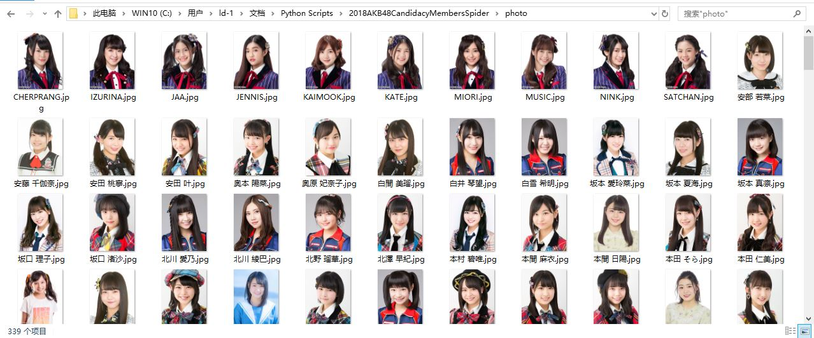
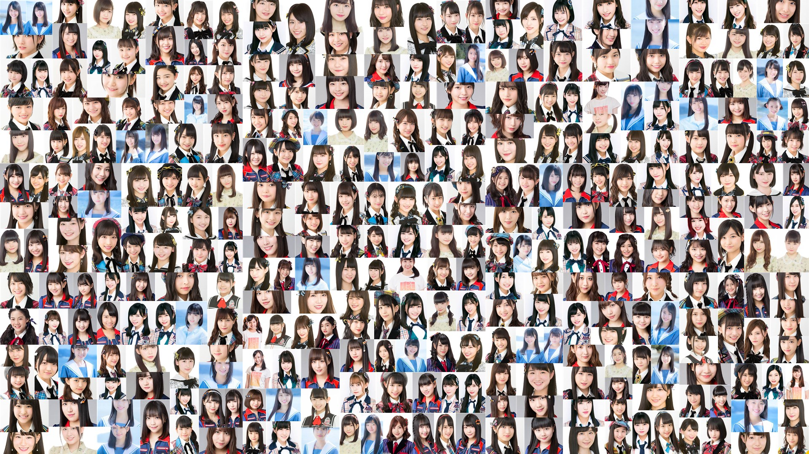

# 2018 AKB48 Candidacy Members Spider
「AKB48 53rd Single 世界选拔总选举」立候补成员信息爬虫。官方主页：
[AKB48公式サイト | AKB48 53rdシングル 世界選抜総選挙](https://www.akb48.co.jp/sousenkyo53rd)

## Description
- 抓取所有立候補成员（[AKB48公式サイト | AKB48 53rdシングル 世界選抜総選挙 :立候補メンバー](https://www.akb48.co.jp/sousenkyo53rd/candidate)）的详细个人信息、立候補时间、目标排名、速报排名、本届总选举排名、历年总选举排名，生成Excel表格（member_info.xlsx）
- 抓取所有立候補成员的公式照,保存到photo文件夹下
- 抓取所有立候補成员的竞选海报,保存到poster文件夹下
- 最终应该能获取339名成员的信息，如若获取不全可重新运行脚本，已经下载的公式照和竞选海报不会被重复下载
- 使用线程池提高处理效率

## Dependencies
- requests
- pyquery
- re
- pandas
- multiprocessing

## Screenshot

### Excel数据

### 成员公式照

### 成员海报

### 成员公式照拼图
>使用[CollageIt Pro 1.9.4](https://www.portablesoft.org/collageit/)制作

### 成员海报拼图
>使用[CollageIt Pro 1.9.4](https://www.portablesoft.org/collageit/)制作

